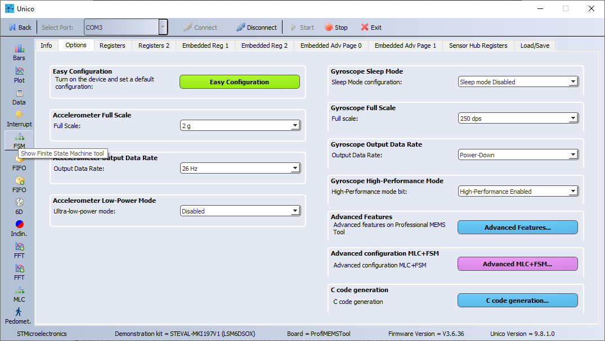
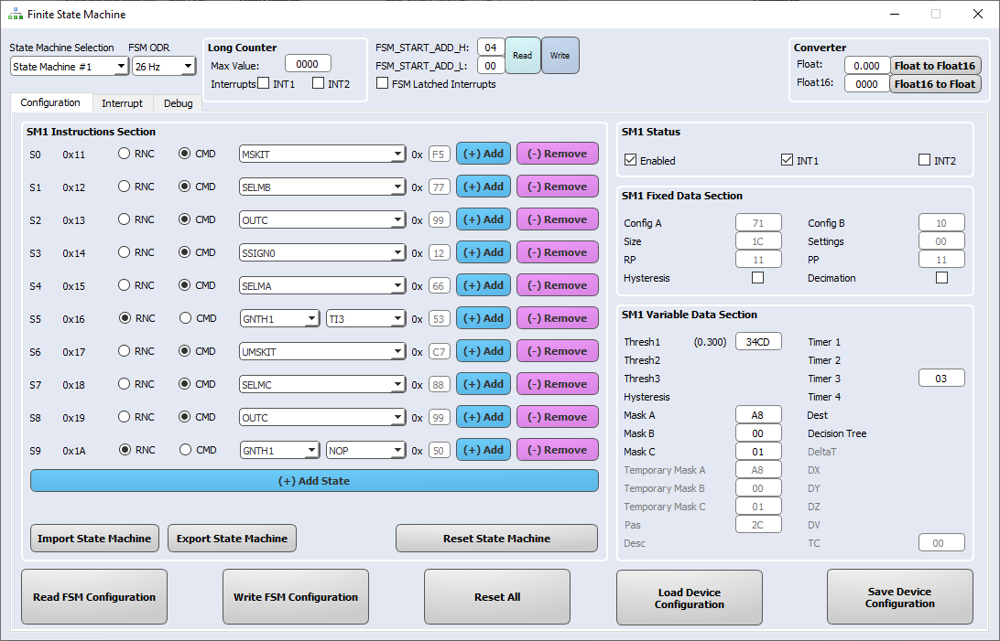
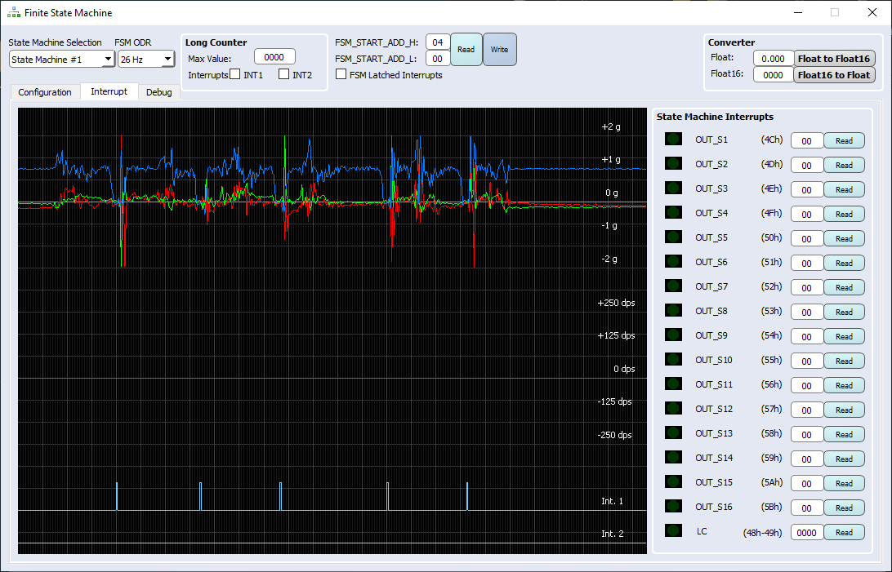

This README file describes how to program the **Finite State Machine (FSM)** hardware logic embedded in the ST sensors.

Use of this feature provides incredible flexibility for customized motion-pattern recognition in an ultra-low-power domain.

This example explains how to configure the **FSM** to implement a freeall detector, used to determine when the device is falling.

**Software**: 

In order to easily program the **FSM** the **Unico GUI** software tool will be used. 

For more details on the software tools:

- [Unico GUI](https://www.st.com/content/st_com/en/products/embedded-software/evaluation-tool-software/unico-gui.html) software tool to work with ProfiMEMS evaluation board (see the next paragraph for more details).
- [Unicleo GUI](https://www.st.com/content/st_com/en/products/embedded-software/evaluation-tool-software/unicleo-gui.html) software tool to work with [Nucleo](https://www.st.com/content/st_com/en/products/evaluation-tools/product-evaluation-tools/mcu-mpu-eval-tools/stm32-mcu-mpu-eval-tools/stm32-nucleo-boards.html) motherboards coupled with X-Nucleo expansion boards, and in particular the MEMS expansions (the latest is [X-Nucleo-IKS01A3](https://www.st.com/content/st_com/en/products/ecosystems/stm32-open-development-environment/stm32-nucleo-expansion-boards/stm32-ode-sense-hw/x-nucleo-iks01a3.html)).
- [AlgoBuilder GUI](https://www.st.com/content/st_com/en/products/embedded-software/mems-and-sensors-software/inemo-engine-software-libraries/algobuilder.html) software tool to design a custom processing flow and build the firmware for Nucleo boards coupled with the MEMS expansions, or small form-factor evaluation boards (such as [SensorTile.Box](https://www.st.com/content/st_com/en/products/evaluation-tools/product-evaluation-tools/mems-motion-sensor-eval-boards/steval-mksbox1v1.html)).

**Hardware**: 

In this example we will be using the **LSM6DSOX inertial measurement unit (IMU)**, with an accelerometer and a gyroscope sensor (see the next paragraph for more details). However, the same procedure also applies to other sensors with FSM support.

For more details on the hardware:

- ST resource page on [MEMS sensor](https://www.st.com/mems)
- Application note [AN5273](https://www.st.com/content/ccc/resource/technical/document/application_note/group1/6f/b8/c2/59/7e/00/43/c6/DM00572971/files/DM00572971.pdf/jcr:content/translations/en.DM00572971.pdf) on FSM embedded in [LSM6DSOX](https://www.st.com/content/st_com/en/products/mems-and-sensors/inemo-inertial-modules/lsm6dsox.html) 

# 1. Setup

The first step is to setup the hardware and software tools.

**Hardware** needed:

- [STEVAL-MKI109V3](https://www.st.com/content/st_com/en/products/evaluation-tools/product-evaluation-tools/mems-motion-sensor-eval-boards/steval-mki109v3.html), professional evaluation board for MEMS sensors, referenced as **ProfiMEMS** in ST’s documentation. It is based on the STM32F401 microcontroller and features a DIL24 connector which plugs into the daughterboard to connect the sensor under test. Check that the firmware is up-to-date (version 3.6.36 or later).

- [STEVAL-MKI197V1](https://www.st.com/content/st_com/en/products/evaluation-tools/product-evaluation-tools/mems-motion-sensor-eval-boards/steval-mki197v1.html), daughterboard with **LSM6DSOX** IMU sensor (referenced as **DIL24 adapter** in ST’s documentation). It must be plugged into the ProfiMEMS motherboard.

- Micro USB cable to connect the ProfiMEMS motherboard to the PC.

  **Note**: Although ProfiMEMS has been used in this example, other platforms are supported (see [Getting started with ST development kit and GUI](https://www.st.com/content/ccc/resource/sales_and_marketing/presentation/product_presentation/group0/f6/ab/59/ed/d8/d0/4a/47/MLC_tools_and_GUI/files/MLC_tools_and_GUI.pdf/_jcr_content/translations/en.MLC_tools_and_GUI.pdf)).

**Software** needed:

- [STSW-MKI109W(/L/M)](https://www.st.com/en/embedded-software/unico-gui.html), referenced as **Unico GUI**, companion software to work with the ProfiMEMS motherboard (version 9.8.1.0 or later).

Follow the procedure below to start working with **Unico GUI**:

1. Plug in the DIL24 LSM6DSOX adapter to the ProfiMEMS motherboard and connect the motherboard to the PC using the Micro USB cable. 

2. Run Unico GUI and select *LSM6DSOX* from the *iNemo Inertial Modules* list and confirm by pressing the *Select Device* button.

   

3. Click on the *Options* tab and configure the accelerometer: 2g full scale, 26Hz output data rate, low-power mode disabled.

4. Click on the *Start* button in the top bar and click *Plot* to check the data in real-time.

   

# 2. Free-fall FSM development

**Unico GUI** provides a dedicated tool for FSM development, which can be run by clicking on the *FSM* button available in the left toolbar.

Once opened, the FSM tool allows the user to implement a FSM (up to 16 different FSMs), configure the FSM function processing rate, enable / route interrupt events on the INT1 and / or INT2 pins.

The default FSM selected is the first one (*State Machine #1*) and the default processing rate is 26 Hz. There is no need to change them for this example.

A simple free-fall detector can be implemented by comparing the current X, Y, Z accelerometer signals with a threshold. Specifically, the aim is to generate an interrupt signal if all the current accelerometer axes data are below a threshold for a predefined time, so the FSM is composed of the following instructions:

* S0 instruction is a Command (CMD): MSKIT.

  The MSKIT command is used to mask the interrupt generation.

* S1 instruction is a Command (CMD): SELMB.

  The SELMB command is used to select Mask B as the current mask (in this case, Mask B = 00h).

* S2 instruction is a Command (CMD): OUTC.

  The OUTC command is used to write the temporary mask to the output registers (in this case, TMask B = Mask B = 00h). It will clear the content of the OUTS register by writing 00h in the OUT_S1 register without generating an interrupt signal (due to MSKIT command at S0 instruction).

* S3 instruction is a Command (CMD): SSIGN0.

  The SSIGN0 command is used to set the *unsigned* comparison mode.

* S4 instruction is a Command (CMD): SELMA.

  The SELMA command is used to select Mask A as the current mask (in this case, Mask A = A8h). By setting Mask A = A8h, the X, Y, Z accelerometer axes are selected.

* S5 instruction is a Reset/Next Condition (RNC): GNTH1| TI3.

  The *reset* condition is a GNTH1: the program will reset if any axis (X, Y or Z) is above the configured threshold specified in the proper field. 

  Once GNTH1 is selected as *reset* condition, one field in the right view will be available: *Thresh1*,  where the user can specify the threshold (in hexadecimal format).

  Since the acceleration threshold must be set in HFP (half floating point) hexadecimal format, a *Converter* is available in the top right view. In this example, we want to compare the accelerometer axes against a threshold of 0.3 g. Thus, we set *Mask A = A8h* and the *Thresh1 = 34CDh*.

  The *next* condition is a TI3: the program goes to the next instruction when the timer elapses. The timer is preloaded with the value specified by the *Timer 3* parameter: 03h (i.e. 3 samples).

  By combining the GNTH1 *reset* and the TI3 *next* conditions, the program flow will be the following: go to the next state (S6) if all the three accelerometer axes are below or equal to the 0.3 g threshold for 3 consecutive samples (i.e. ~115 ms).

* S6 instruction is a Command (CMD): UMSKIT.

  The UMSKIT command is used to unmask the interrupt generation.

* S7 instruction is a Command (CMD): SELMC.

  The SELMC command is used to select Mask C as the current mask (in this case, Mask C = 01h).

* S8 instruction is a Command (CMD): OUTC.

  The OUTC command is used to write the temporary mask to the output registers (in this case, TMask C = Mask C = 01h). It will set the content of the OUTS register by writing 01h (signaling a free-fall event) in the FSM_OUTS1 register and generate an interrupt signal.

* S9 instruction is a Reset/Next Condition (RNC): GNTH1| NOP.

  By combining the GNTH1 *reset* and the NOP *next* conditions, the program flow will loop on the current state (S9) until all three accelerometer axes are below or equal to the 0.3 g threshold. The FSM is reset as soon as at least one of the X, Y, Z accelerometer signals goes above 0.3 g.

In order to route the interrupt signal to the INT1 pin, the INT1 checkbox under the *SM1 Status* view must be checked.

The whole FSM should look like the following image.

In order to actually write the FSM to the LSM6DSOX, the user must press the *Write FSM Configuration* button. The sensor will be configured to detect free-fall events and route them to the INT1 pin. This configuration can be runtime tested using the *Interrupt* tab.

Since the free-fall detector works as expected, we can save it in a Unico Configuration File (ucf) in order to be able to load this device configuration in the future. In order to do this:

1. Go back to *Configuration* tab.
2. Click on *Save Device Configuration* button.
3. Save it on the PC (e.g. *freefall.ucf*).

**UCF** stands for Unico Configuration File. It is a text file with a sequence of register addresses and corresponding values. It contains the full sensor configuration, including of course the FSM configuration. 

The UCF file can be used as-is by several software tools provided by ST: Unico GUI, Unicleo GUI, AlgoBuilder GUI.

**UCF files can also be converted to C source code** and saved as header *.h* files to be conveniently included in C projects: click on the *Options* tab, select *Browse* and load the UCF file, then click on *Generate C code*.

An example on how to use the generated *.h* file in a standard C driver is available in the [STMems_Standard_C_drivers repository](https://github.com/STMicroelectronics/STMems_Standard_C_drivers/blob/master/lsm6dsox_STdC/example/lsm6dsox_mlc.c).

------

**More Information: [http://www.st.com](http://st.com/MEMS)**

**Copyright © 2020 STMicroelectronics**

