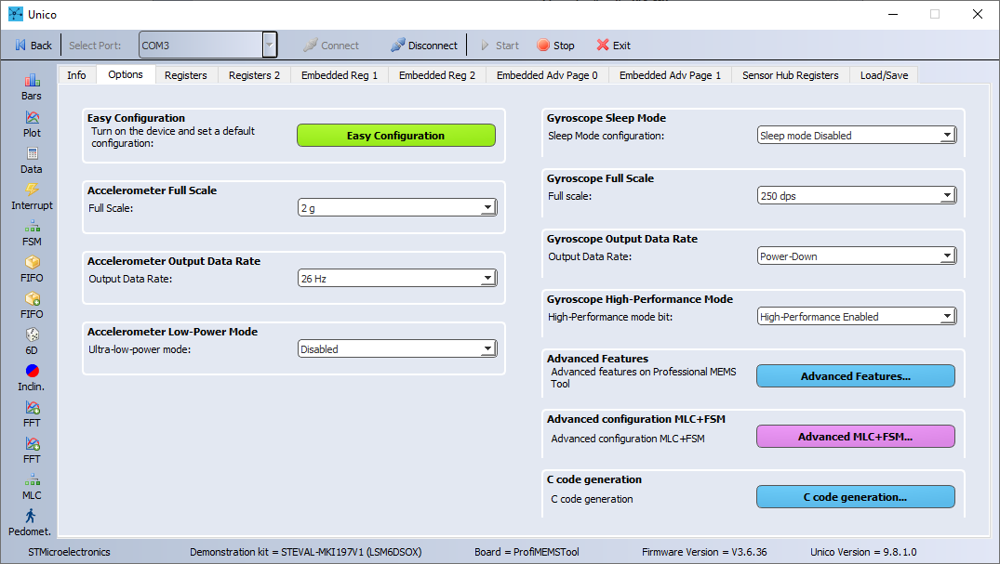
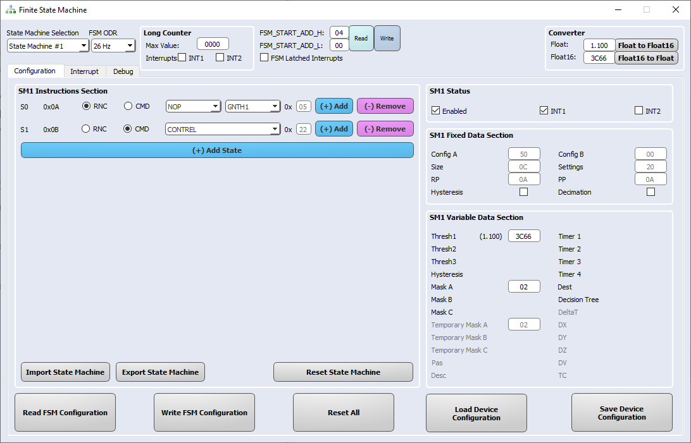
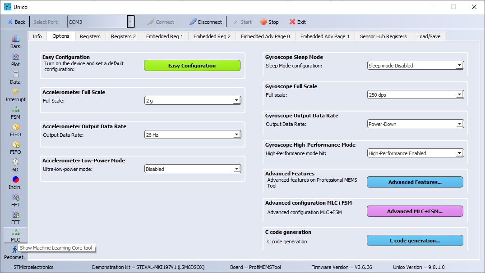
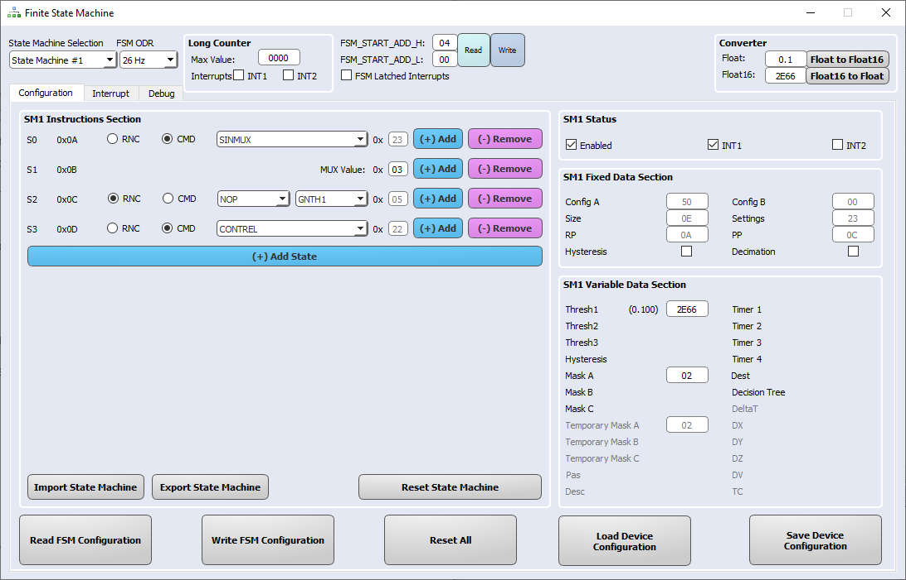
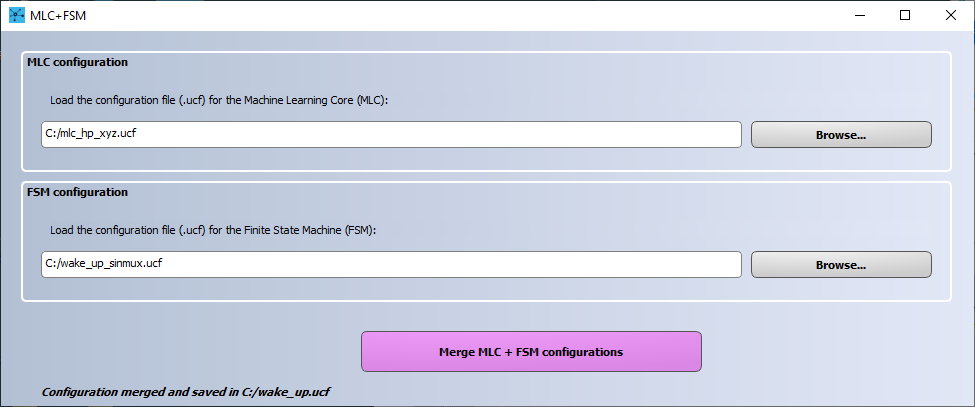
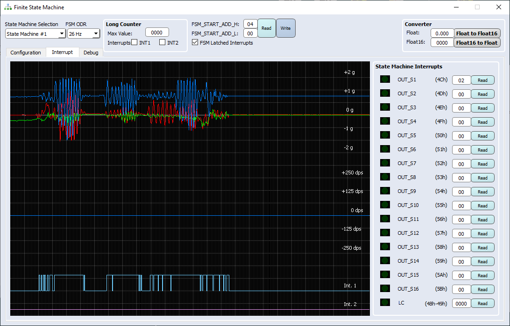

This README file describes how to program the **Finite State Machine (FSM)** and **Machine Learning Core (MLC)** hardware logics embedded in ST sensors.

The combination of these features provides incredible flexibility for customized motion-pattern recognition in an ultra-low-power domain.

This example explains how to configure the **FSM** to implement a wake-up gesture and how to improve it by pre-processing the accelerometer signal thanks to **MLC** filtering capabilities.

**Software**: 

In order to easily program the **FSM** and configure the **MLC** filters, the **Unico GUI** software tool will be used. 

For more details on the software tools:

- [Unico GUI](https://www.st.com/content/st_com/en/products/embedded-software/evaluation-tool-software/unico-gui.html) software tool to work with ProfiMEMS evaluation board (see the next paragraph for more details).
- [Unicleo GUI](https://www.st.com/content/st_com/en/products/embedded-software/evaluation-tool-software/unicleo-gui.html) software tool to work with [Nucleo](https://www.st.com/content/st_com/en/products/evaluation-tools/product-evaluation-tools/mcu-mpu-eval-tools/stm32-mcu-mpu-eval-tools/stm32-nucleo-boards.html) motherboards coupled with X-Nucleo expansion boards, and in particular the MEMS expansions (the latest is [X-Nucleo-IKS01A3](https://www.st.com/content/st_com/en/products/ecosystems/stm32-open-development-environment/stm32-nucleo-expansion-boards/stm32-ode-sense-hw/x-nucleo-iks01a3.html)).
- [AlgoBuilder GUI](https://www.st.com/content/st_com/en/products/embedded-software/mems-and-sensors-software/inemo-engine-software-libraries/algobuilder.html) software tool to design a custom processing flow and build the firmware for Nucleo boards coupled with the MEMS expansions, or small form-factor evaluation boards (such as [SensorTile.Box](https://www.st.com/content/st_com/en/products/evaluation-tools/product-evaluation-tools/mems-motion-sensor-eval-boards/steval-mksbox1v1.html)).

**Hardware**: 

In this example we will be using the **LSM6DSOX inertial measurement unit (IMU)**, with an accelerometer and a gyroscope sensor (see the next paragraph for more details). However, the same procedure also applies to other sensors with FSM and MLC support.

For more details on the hardware:

- ST resource page on [MEMS sensor](https://www.st.com/mems)
- ST resource page on [Explore Machine Learning Core in MEMS sensors](https://www.st.com/content/st_com/en/campaigns/machine-learning-core.html)
- Application note [AN5273](https://www.st.com/content/ccc/resource/technical/document/application_note/group1/6f/b8/c2/59/7e/00/43/c6/DM00572971/files/DM00572971.pdf/jcr:content/translations/en.DM00572971.pdf) on FSM embedded in [LSM6DSOX](https://www.st.com/content/st_com/en/products/mems-and-sensors/inemo-inertial-modules/lsm6dsox.html) 
- Application note [AN5259](https://www.st.com/resource/en/application_note/dm00563460-lsm6dsox-machine-learning-core-stmicroelectronics.pdf) on MLC embedded in [LSM6DSOX](https://www.st.com/content/st_com/en/products/mems-and-sensors/inemo-inertial-modules/lsm6dsox.html) 

# 1. Setup

The first step is to setup the hardware and software tools.

**Hardware** needed:

- [STEVAL-MKI109V3](https://www.st.com/content/st_com/en/products/evaluation-tools/product-evaluation-tools/mems-motion-sensor-eval-boards/steval-mki109v3.html), professional evaluation board for MEMS sensors, referenced as **ProfiMEMS** in ST’s documentation. It is based on the STM32F401 microcontroller and features a DIL24 connector which plugs into the daughterboard to connect the sensor under test. Check that the firmware is up-to-date (version 3.6.36 or later).

- [STEVAL-MKI197V1](https://www.st.com/content/st_com/en/products/evaluation-tools/product-evaluation-tools/mems-motion-sensor-eval-boards/steval-mki197v1.html), daughterboard with **LSM6DSOX** IMU sensor (referenced as **DIL24 adapter** in ST’s documentation). It must be plugged into the ProfiMEMS motherboard.

- Micro USB cable to connect the ProfiMEMS motherboard to the PC.

  **Note**: Even if ProfiMEMS has been used in this example other platforms are supported (see [Getting started with ST development kit and GUI](https://www.st.com/content/ccc/resource/sales_and_marketing/presentation/product_presentation/group0/f6/ab/59/ed/d8/d0/4a/47/MLC_tools_and_GUI/files/MLC_tools_and_GUI.pdf/_jcr_content/translations/en.MLC_tools_and_GUI.pdf)).

**Software** needed:

- [STSW-MKI109W(/L/M)](https://www.st.com/en/embedded-software/unico-gui.html), referenced as **Unico GUI**, companion software to work with the ProfiMEMS motherboard (version 9.8.1.0 or later).

Follow the procedure below to start working with **Unico GUI**:

1. Plug the DIL24 LSM6DSOX adapter in the ProfiMEMS motherboard and connect the motherboard to the PC using the Micro USB cable. 

2. Run Unico GUI and select *LSM6DSOX* from the *iNemo Inertial Modules* list and confirm by pressing the *Select Device* button.

   

3. Click on the *Options* tab and configure the accelerometer: 2g full scale, 26Hz output data rate, low-power mode disabled.

4. Click on the *Start* button in the top bar and click *Plot* to check the data in real-time.

   

# 2. Wake-up FSM development

**Unico GUI** provides a dedicated tool for FSM development, which can be run by clicking on the *FSM* button available in the left toolbar.

Once opened, the FSM tool allows the user to implement a FSM (up to 16 different FSMs), configure the FSM function processing rate, enable / route interrupt events on the INT1 and / or INT2 pins.

The default FSM selected is the first one (*State Machine #1*) and the default processing rate is 26 Hz. There is no need to change them for this example.

A simple wake-up gesture can be implemented by comparing the current accelerometer signal with a threshold. The FSM instruction used for threshold comparison is GNTH1.

The aim is to generate an interrupt signal if the current accelerometer sample is greater than a threshold, so the FSM is composed of the following instructions:

* S0 instruction is a Reset/Next Condition (RNC): NOP | GNTH1.

  The *reset* condition is a NOP: thus, the program will never reset at S0.

  The *next* condition is a GNTH1: the program goes to the next instruction if the condition is verified, i.e. if the accelerometer axis or norm selected by the mask is greater than the threshold specified in the proper field.

  Once GNTH1 is selected as *next* condition, two fields in the right view will be available:

  * *Thresh1*,  where the user can specify the threshold (in hexadecimal format)
  * *Mask A*, where the user can specify the mask (in hexadecimal format)

  Since the acceleration threshold must be set in HFP (half floating point) hexadecimal format, a *Converter* is available in the top right view. In this example, we want to compare the acceleration norm against a threshold of 1.1 g. Thus, we set *Mask A = 02h* and the *Thresh1 = 3C66h*.

* S1 instruction is a Command (CMD): CONTREL.

  The CONTREL command is used to continue the execution from reset pointer, reset the temporary mask and generate the interrupt signal.

In order to route the interrupt signal to the INT1 pin, the INT1 checkbox under *SM1 Status* view must be checked.

The whole FSM should look like the following image.

In order to actually write the FSM to the LSM6DSOX, the user must press the *Write FSM Configuration* button. The sensor will be configured to recognize wake-up events and route them to the INT1 pin. This configuration can be runtime tested using the *Interrupt* tab.

Since the gesture works as expected, we can save it in a Unico Configuration File (ucf) in order to be able to load this device configuration in the future. In order to do this:

1. Go back to *Configuration* tab.
2. Click on *Save Device Configuration* button.
3. Save it on the PC (e.g. *wake_up_no_filter.ucf*).

**UCF** stands for Unico Configuration File. It is a text file with a sequence of register addresses and corresponding values. It contains the full sensor configuration, including of course the FSM/MLC configuration. 

The UCF file can be used as-is by several software tools provided by ST: Unico GUI, Unicleo GUI, AlgoBuilder GUI.

**UCF files can also be converted to C source code** and saved as header *.h* files to be conveniently included in C projects: click on the *Options* tab, select *Browse* and load the UCF file, then click on *Generate C code*.

An example on how to use the generated *.h* file in a standard C driver is available in the [STMems_Standard_C_drivers repository](https://github.com/STMicroelectronics/STMems_Standard_C_drivers/blob/master/lsm6dsox_STdC/example/lsm6dsox_mlc.c).

# 3. MLC filtering capabilities

The Machine Learning Core can be programmed to filter the signal which is input to the FSM.

In this example, we need to high-pass filter the acceleration data: so, we will generate an MLC configuration containing a high-pass filter.

**Unico GUI** provides a dedicated tool for MLC configuration, which can be run by clicking on the *MLC* button available in the left toolbar.

Since in this example we only want to generate a filter, we can skip the data patterns loading phase and open the *Configuration* tab.

We can configure the MLC as follows:

1. Select *LSM6DSOX* device.

2. Select *26 Hz* MLC output data rate (i.e. internal processing rate for MLC block).

3. Select *Accelerometer only*, configured with full scale of 2g and output data rate of 26 Hz.

4. Select a number of decision trees equal to 0 (we just want the MLC to produce filtered accelerometer data).

5. Select a filter, in particular *HP ACC (xyz)*, which implements a first order difference filter (DIFF).

   *Note: The MLC tool allows also creating a generic 1st order / 2nd order IIR filter by setting desired filter coefficients*

6. End filter configuration.

7. Save the MLC filter configuration in ucf format (e.g. *mlc_hp_xyz.ucf*).

# 4. Merge FSM and MLC configurations

In section 2. and section 3. we generated an FSM and an MLC configuration.

In this section, we are going to fuse them in one unique empowered configuration.

In order to do this, the first step is to configure the FSM to use filtered accelerometer signal as input. For this reason, we modify the previous FSM wake-up configuration as follows:

* Put on top of the FSM a command instruction to select a filtered accelerometer signal as input: SINMUX. SINMUX is a command which needs the path identifier (represented as hexadecimal value) in order to be selected. In our case we want to select the path 03h, which corresponds to the accelerometer filtered signal.
* Change the threshold. Since we are using a high-pass filter, the 1g DC component due to the gravity can be removed, thus setting a threshold for the example equal to 0.1g.

The new FSM would be like the one in the image below:

The FSM is written to the device by clicking the *Write FSM Configuration* button and it can be saved by clicking the *Save Device Configuration* button (e.g. wake_up_sinmux.ucf).

If testing it now, we should not get any interrupt, because the MLC filter configuration has not been loaded yet.

In order to do this, we need to merge the MLC and FSM configurations (previously saved as *ucf* files). Under the *Options* tab, a dedicated tool is available by clicking the *Advanced MLC+FSM* button in the bottom right view.

This tool allows selecting both an FSM tool generated and an MLC tool generated ucf files and merging them in a unique configuration file by following the steps below:

1. Load the MLC tool generated ucf file (e.g.  *mlc_hp_xyz.ucf*)
2. Load the FSM tool generated ucf file (e.g.  *wake_up_sinmux.ucf*)
3. Click on *Merge MLC + FSM configurations* button and save it on the PC (e.g. *wake_up.ucf*)

The new generated ucf (e.g. *wake_up.ucf*) can now be loaded in order to configure the LSM6DSOX with the new MLC + FSM configuration.

In order to do this, open the *Load / Save* tab, click on the *Load* button and select the desired ucf file, whose configuration will be immediately loaded in the connected LSM6DSOX device.

FSM behavior can be tested as previously shown, opening the *FSM* tool and selecting the *Interrupt* tab.

------

**More Information: [http://www.st.com](http://st.com/MEMS)**

**Copyright © 2020 STMicroelectronics**
