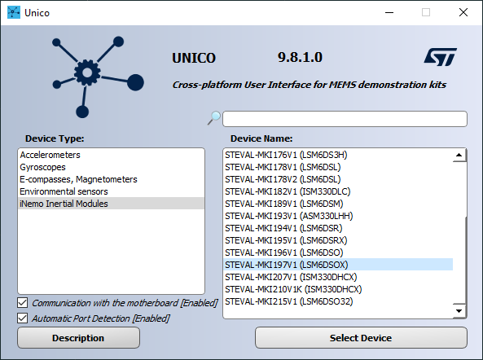
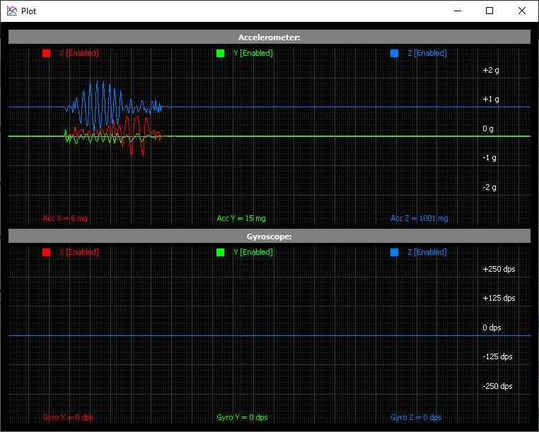
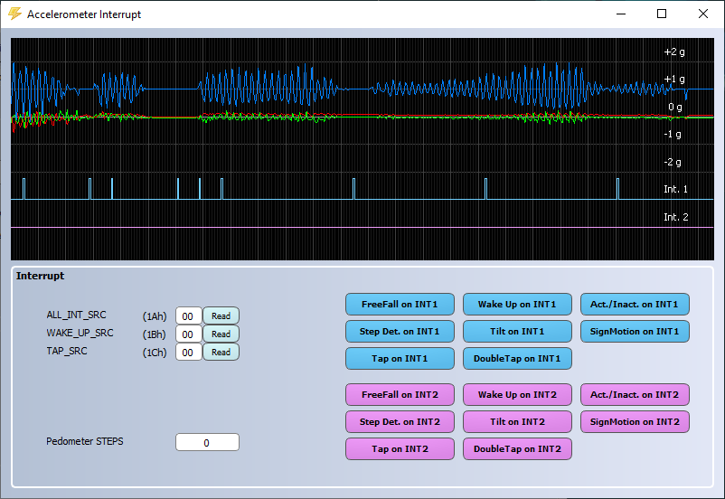
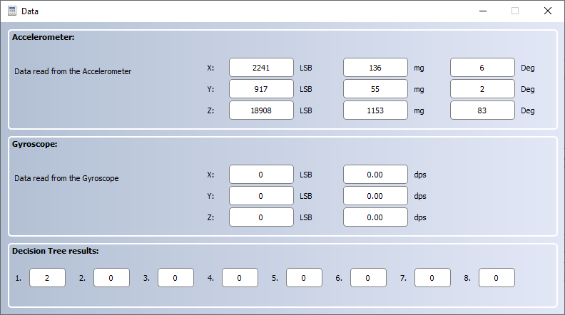
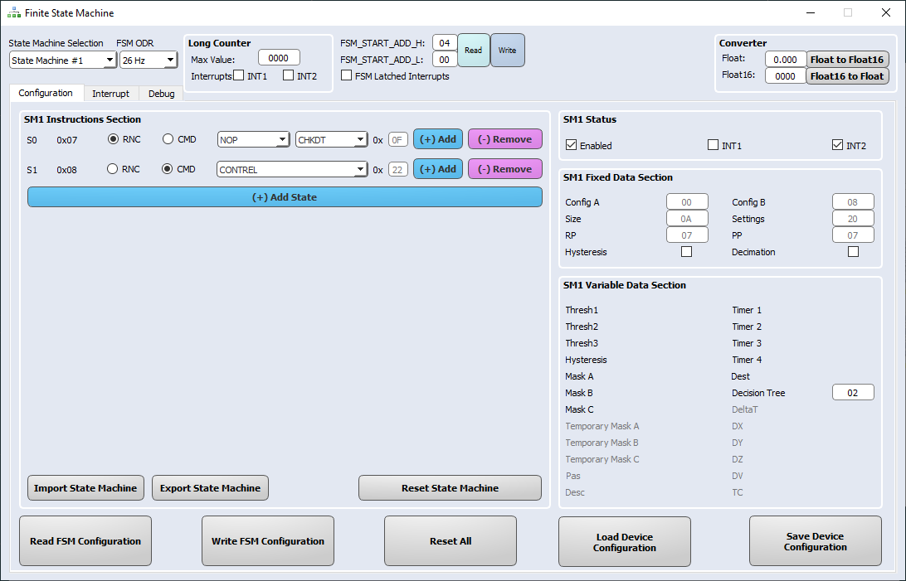
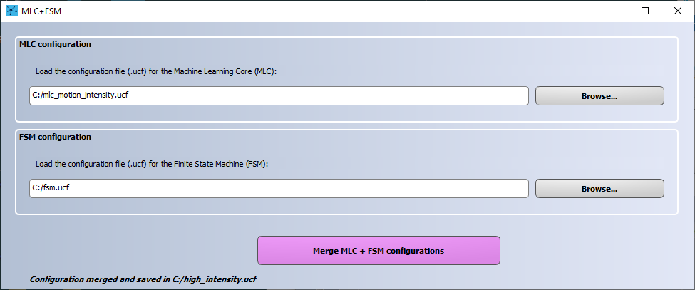
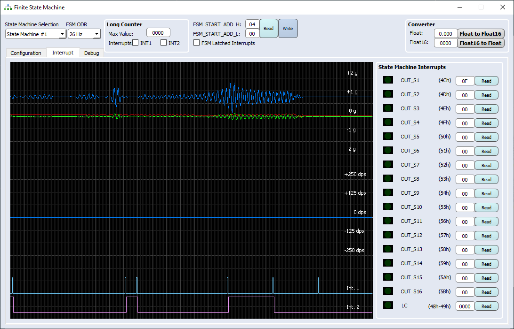

This README file describes how to program the **Finite State Machine (FSM)** and **Machine Learning Core (MLC)** hardware logics embedded in ST sensors.

The combination of these features provides incredible flexibility for customized motion-pattern recognition in an ultra-low-power domain.

This example explains how to configure the **FSM** to process **MLC** output (i.e. check the output value of a decision tree and generate an interrupt when it corresponds to the expected value).

**Software**: 

In order to easily program the **FSM** and configure the **MLC** filters, the **Unico GUI** software tool will be used. 

For more details on the software tools:

- [Unico GUI](https://www.st.com/content/st_com/en/products/embedded-software/evaluation-tool-software/unico-gui.html) software tool to work with ProfiMEMS evaluation board (see the next paragraph for more details).
- [Unicleo GUI](https://www.st.com/content/st_com/en/products/embedded-software/evaluation-tool-software/unicleo-gui.html) software tool to work with [Nucleo](https://www.st.com/content/st_com/en/products/evaluation-tools/product-evaluation-tools/mcu-mpu-eval-tools/stm32-mcu-mpu-eval-tools/stm32-nucleo-boards.html) motherboards coupled with X-Nucleo expansion boards, and in particular the MEMS expansions (the latest is [X-Nucleo-IKS01A3](https://www.st.com/content/st_com/en/products/ecosystems/stm32-open-development-environment/stm32-nucleo-expansion-boards/stm32-ode-sense-hw/x-nucleo-iks01a3.html)).
- [AlgoBuilder GUI](https://www.st.com/content/st_com/en/products/embedded-software/mems-and-sensors-software/inemo-engine-software-libraries/algobuilder.html) software tool to design a custom processing flow and build the firmware for Nucleo boards coupled with the MEMS expansions, or form-factor evaluation boards (such as [SensorTile.Box](https://www.st.com/content/st_com/en/products/evaluation-tools/product-evaluation-tools/mems-motion-sensor-eval-boards/steval-mksbox1v1.html)).

**Hardware**: 

In this example we will be using the **LSM6DSOX inertial measurement unit (IMU)**, with an accelerometer and a gyroscope sensor (see the next paragraph for more details). However, the same procedure also applies to other sensors with FSM and MLC support.

For more details on the hardware:

- ST resource page on [MEMS sensor](https://www.st.com/mems)
- ST resource page on [Explore Machine Learning Core in MEMS sensors](https://www.st.com/content/st_com/en/campaigns/machine-learning-core.html)
- Application note [AN5273](https://www.st.com/content/ccc/resource/technical/document/application_note/group1/6f/b8/c2/59/7e/00/43/c6/DM00572971/files/DM00572971.pdf/jcr:content/translations/en.DM00572971.pdf) on FSM embedded in [LSM6DSOX](https://www.st.com/content/st_com/en/products/mems-and-sensors/inemo-inertial-modules/lsm6dsox.html) 
- Application note [AN5259](https://www.st.com/resource/en/application_note/dm00563460-lsm6dsox-machine-learning-core-stmicroelectronics.pdf) on MLC embedded in [LSM6DSOX](https://www.st.com/content/st_com/en/products/mems-and-sensors/inemo-inertial-modules/lsm6dsox.html) 

# 1. Setup

The first step is to setup the hardware and software tools.

**Hardware** needed:

- [STEVAL-MKI109V3](https://www.st.com/content/st_com/en/products/evaluation-tools/product-evaluation-tools/mems-motion-sensor-eval-boards/steval-mki109v3.html), professional evaluation board for MEMS sensors, referenced as **ProfiMEMS** in ST’s documentation. It is based on the STM32F401 microcontroller and features a DIL24 connector which plugs into the daughterboard to connect the sensor under test. Check that the firmware is up-to-date (version 3.6.36 or later).

- [STEVAL-MKI197V1](https://www.st.com/content/st_com/en/products/evaluation-tools/product-evaluation-tools/mems-motion-sensor-eval-boards/steval-mki197v1.html), daughterboard with **LSM6DSOX** IMU sensor (referenced as **DIL24 adapter** in ST’s documentation). It must be plugged into the ProfiMEMS motherboard.

- Micro USB cable to connect the ProfiMEMS motherboard to the PC.

  **Note**: Although ProfiMEMS has been used in this example, other platforms are supported (see [Getting started with ST development kit and GUI](https://www.st.com/content/ccc/resource/sales_and_marketing/presentation/product_presentation/group0/f6/ab/59/ed/d8/d0/4a/47/MLC_tools_and_GUI/files/MLC_tools_and_GUI.pdf/_jcr_content/translations/en.MLC_tools_and_GUI.pdf)).

**Software** needed:

- [STSW-MKI109W(/L/M)](https://www.st.com/en/embedded-software/unico-gui.html), referenced as **Unico GUI**, companion software to work with the ProfiMEMS motherboard (version 9.8.1.0 or later).

Follow the procedure below to start working with **Unico GUI**:

1. Plug the DIL24 LSM6DSOX adapter in the ProfiMEMS motherboard and connect the motherboard to the PC using the Micro USB cable. 

2. Run Unico GUI and select *LSM6DSOX* from the *iNemo Inertial Modules* list and confirm by pressing the *Select Device* button.

   

3. Click on the *Options* tab and configure the accelerometer: 2g full scale, 26Hz output data rate, low-power mode disabled.

4. Click on the *Start* button in the top bar and click *Plot* to check the data in real-time.

   

# 2. Load an MLC configuration file

First of all, we need to load an existing previously generated MLC configuration file. This can be done by loading a ucf file.

**UCF** stands for Unico Configuration File. It is a text file with a sequence of register addresses and corresponding values. It contains the full sensor configuration, including of course the MLC configuration. 

The UCF file can be used as-is by several software tools provided by ST: Unico GUI, Unicleo GUI, AlgoBuilder GUI.

**UCF files can also be converted to C source code** and saved as header *.h* files to be conveniently included in C projects: click on the *Options* tab, select *Browse* and load the UCF file, then click on *Generate C code*.

An example on how to use the generated *.h* file in a standard C driver is available in the [STMems_Standard_C_drivers repository](https://github.com/STMicroelectronics/STMems_Standard_C_drivers/blob/master/lsm6dsox_STdC/example/lsm6dsox_mlc.c).

In this example, *mlc_motion_intensity.ucf* is loaded, containing a simple decision tree which detects three levels of motion intensity, based on peak-to-peak acceleration signals. The output classes are:

* 00h, low intensity
* 01h, normal intensity
* 02h, high intensity

The configuration file can be loaded following the procedure below:

1. Open the *Load / Save* tab 
2. Click on the *Load* button
3. Select the *mlc_motion_intensity.ucf* file

After loading the ucf file, the configuration can be tested by opening both the *Interrupt* and the *Data* tools from the left toolbar.

In this configuration, the MLC interrupt signal is routed to the INT1 pin: an interrupt pulse is generated each time the detected class changes.

The currently detected class is shown in the *Data* tab, specifically in the *Decision Tree results* view. In this example, only the first cell updates its value, since the MLC is configured for using one decision tree only. 

# 2. FSM development

**Unico GUI** provides a dedicated tool for FSM development, which can be run by clicking on the FSM button available in the left toolbar.

Once opened, the FSM tool allows the user to implement an FSM (up to 16 different FSMs), configure the FSM function processing rate, enable / route interrupt events to the INT1 and / or INT2 pins.

The default FSM selected is the first one (*State Machine #1*) and the default processing rate is 26 Hz. There is no need to change them for this example.

Each FSM, in addition to the accelerometer, gyroscope, external sensor and filtered data processing, can also check if the result of any decision tree is the expected one by using the CHKDT condition.

In this example, we want to configure the State Machine #1 for checking if the output of the motion intensity classifier is equal to 02h (i.e. high intensity) and generating an interrupt on the INT2 pin when this condition occurs.

The FSM is composed of the following instructions:

* S0 instruction is a Reset/Next Condition (RNC): NOP | CHKDT.

  The *reset* condition is an NOP: thus, the program will never reset at S0.

  The *next* condition is a CHKDT: the program goes to the next instruction if the condition is verified, i.e. if the selected decision tree output is equal to the expected output.

  The selected decision tree and the expected output can be set in the *Decision Tree* cell (in the right view) which must contain a byte in the following hexadecimal format:

  * The left nibble must contain the identifier of the selected decision tree (from 0h to 7h)
  * The right nibble must contain the value of the expected class (from 0h to Fh)

  In our case, the *Decision tree* cell is set to 02h, in order to check if the first decision tree classifies the current window as *high intensity*.

* S1 instruction is a Command (CMD): CONTREL.

  The CONTREL command is used to continue the execution from the reset pointer, reset the temporary mask and generate the interrupt signal.

In order to route the interrupt signal to the INT2 pin, the INT2 checkbox under *SM1 Status view* must be checked.

The whole FSM should look like the following image.

In order to actually write the FSM to the LSM6DSOX, the user must press the *Write FSM Configuration* button. The sensor will be configured to check the high intensity motion and set the INT2 pin accordingly. The FSM configuration can be saved in a Unico Configuration File (ucf) in order to be able to load this device configuration in the future. In order to do this:

1. Go back to the *Configuration* tab.

2. Click on the *Save Device Configuration* button.

3. Save it on the PC (e.g. *fsm.ucf*).

   *Note: after executing step 3 above, the fsm.ucf file contains the FSM configuration only (the MLC configuration is not included in it - see next section for FSM+MLC configuration creation).*

# 4. Merge FSM and MLC configurations

In section 3. an FSM configuration has been added on top of an existing MLC configuration. Anyway, when we saved the *fsm.ucf* file, the FSM configuration only was saved on the PC. For this reason, if the *fsm.ucf* is loaded on a new device or after **UNICO  GUI** reboot, no interrupt will be generated (due to the missing MLC configuration).

In order to have a unique ucf including both the MLC and FSM configurations, **UNICO GUI** provides a tool for merging them. It is available under the *Options* tab by clicking the *Advanced MLC+FSM* button in the bottom right view.

This tool allows selecting both FSM tool generated and MLC tool generated ucf files and merging them in a unique configuration file by following the steps below:

1. Load the MLC tool generated ucf file (e.g.  *mlc_motion_intensity*)
2. Load the FSM tool generated ucf file (e.g.  *fsm.ucf*)
3. Click on the *Merge MLC + FSM configurations* button and save it on the PC (e.g. *high_intensity.ucf*)

The newly generated ucf (e.g. *high_intensity.ucf*) can now be loaded in order to configure the LSM6DSOX with the new MLC + FSM configuration.

In order to do this, open the *Load / Save* tab, click on the *Load* button and select the desired ucf file, whose configuration will be immediately loaded in the connected LSM6DSOX device.

Note: **UNICO GUI** automatically enables the EMB_FUNC_LIR bit in the PAGE_RW (17h) register when merging MLC and FSM configurations. In order to have interrupt pulsed behavior, this bit must be set to 0 using the following procedure:

1. Open the *Embedded Reg 1* tab of UNICO GUI
2. Set *PAGE_RW = 00h* and click on the corresponding *write* button.

This configuration (with EMB_FUNC_LIR = 0) can be runtime tested using the *Interrupt* tab, as shown in the image below.

------

**More Information: [http://www.st.com](http://st.com/MEMS)**

**Copyright © 2020 STMicroelectronics**
