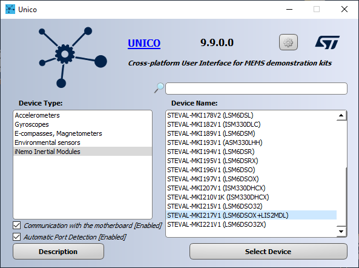
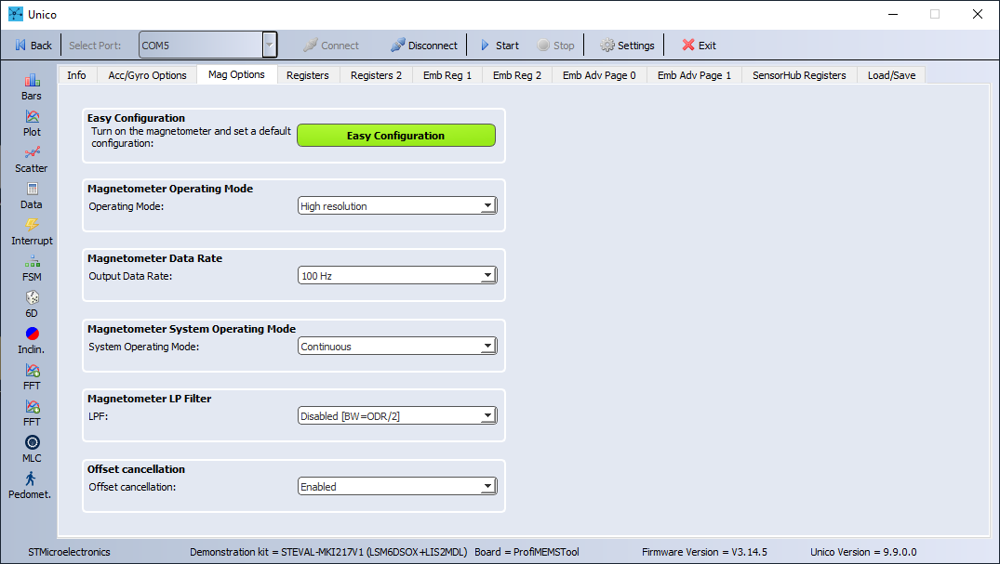
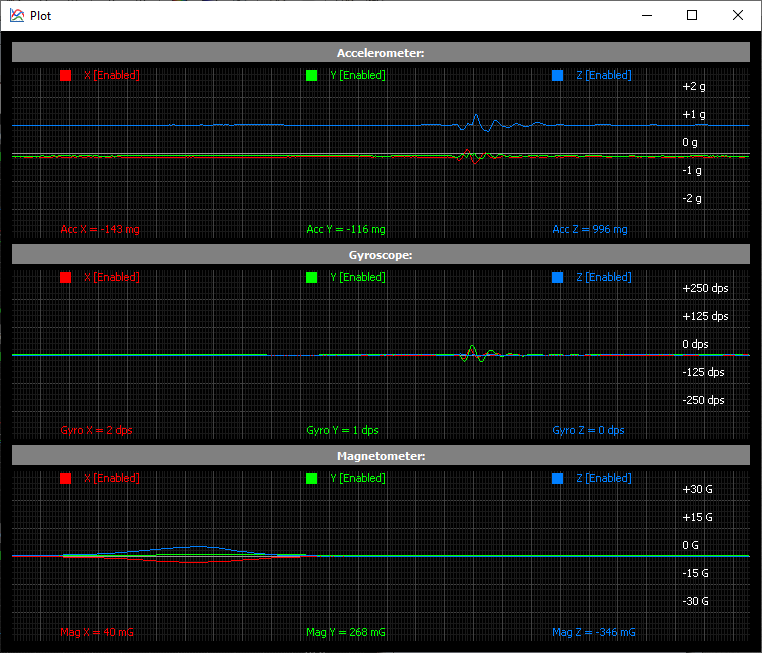
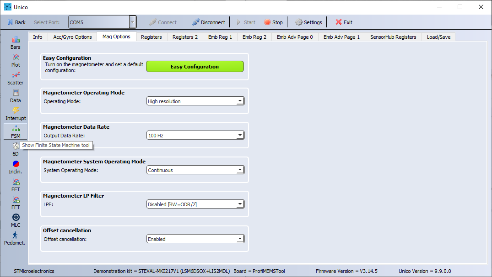
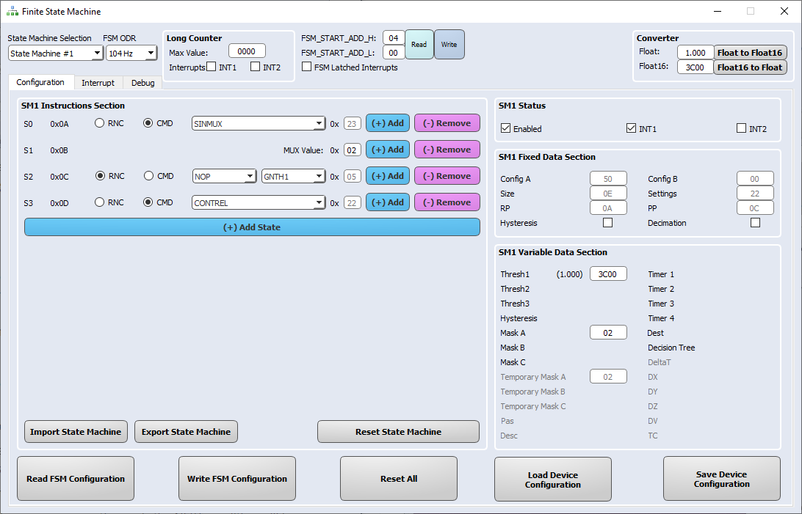
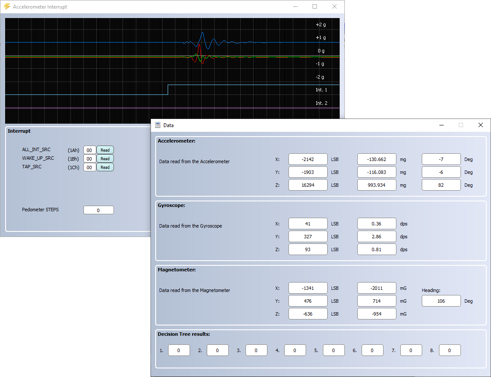

This README file describes how to program the **Finite State Machine (FSM)** hardware logic in ST sensors. 

The usage of this feature provides incredible flexibility for customized motion-pattern recognition in an ultra-low-power domain.

This example shows how the FSM embedded in the ST MEMS sensor can process the sensor data gathered from an external magnetometer to detect magnetic anomalies.

**Software**:

In order to easily program the **FSM**, the **Unico GUI** software tool will be used.

For more details on the software tools:

- [Unico GUI](https://www.st.com/content/st_com/en/products/embedded-software/evaluation-tool-software/unico-gui.html) software tool which works with ProfiMEMS evaluation board (see the next paragraph for more details).
- [Unicleo GUI](https://www.st.com/content/st_com/en/products/embedded-software/evaluation-tool-software/unicleo-gui.html) software tool which works with [Nucleo](https://www.st.com/content/st_com/en/products/evaluation-tools/product-evaluation-tools/mcu-mpu-eval-tools/stm32-mcu-mpu-eval-tools/stm32-nucleo-boards.html) motherboards coupled with X-Nucleo expansion boards, and in particular the MEMS expansions (the latest is [X-Nucleo-IKS01A3](https://www.st.com/content/st_com/en/products/ecosystems/stm32-open-development-environment/stm32-nucleo-expansion-boards/stm32-ode-sense-hw/x-nucleo-iks01a3.html)).
- [AlgoBuilder GUI](https://www.st.com/content/st_com/en/products/embedded-software/mems-and-sensors-software/inemo-engine-software-libraries/algobuilder.html) software tool which is used to design a custom processing flow and build the firmware for Nucleo boards coupled with the MEMS expansions, or small form-factor evaluation boards (such as [SensorTile.Box](https://www.st.com/content/st_com/en/products/evaluation-tools/product-evaluation-tools/mems-motion-sensor-eval-boards/steval-mksbox1v1.html)).

**Hardware**: 

In this example we will be using the **LSM6DSOX inertial measurement unit (IMU)**, with an accelerometer and a gyroscope sensor, and the **LIS2MDL magnetometer** (see the next paragraph for more details). However, the same procedure also applies to other sensors with FSM support. 

LSM6DSOX allows connecting an external sensor (e.g. a magnetometer, like LIS2MDL in this case) through the Sensor Hub feature (Mode 2): through its I²C master interface the LSM6DSOX can configure the LIS2MDL external magnetometer sensor and read the magnetometer output registers, saving their values in the SENSOR_HUB_1 (02h) through the SENSOR_HUB_6 (07h) registers. These data coming from an external sensor can also be used as input for FSM processing; in this case, the first six Sensor Hub bytes (two bytes per axis) are considered as input for the FSM. In other words, the FSM will directly take as input the content of LSM6DSOX registers from SENSOR_HUB_1 (02h) to SENSOR_HUB_6 (07h).

**Note:** The LSM6DSOX Sensor Hub feature requires having at least one sensor enabled between the accelerometer and the gyroscope (they both cannot be set in Power-Down mode). For that reason, in this example we enabled also the accelerometer and the gyroscope sensors along with the external magnetometer sensor.

For more details on the hardware:

- ST resource page on [MEMS sensor](  https://www.st.com/mems  )
- Application note [AN5273](  https://www.st.com/resource/en/application_note/dm00572971-lsm6dsox-finite-state-machine-stmicroelectronics.pdf  ) on FSM embedded in [LSM6DSOX](https://www.st.com/content/st_com/en/products/mems-and-sensors/inemo-inertial-modules/lsm6dsox.html) 

# 1. Setup

The first step is to set up the hardware and software tools.

**Hardware** needed:

- [STEVAL-MKI109V3]( https://www.st.com/content/st_com/en/products/evaluation-tools/product-evaluation-tools/mems-motion-sensor-eval-boards/steval-mki109v3.html ), professional evaluation board for MEMS sensors, referenced as **ProfiMEMS** in ST docs. It is based on the STM32F401 microcontroller and features a DIL24 connector to plug the daughterboard with the sensor under test to the motherboard. Check that the firmware is up to date (version 3.11.4 or later).

- [STEVAL-MKI217V1](  https://www.st.com/content/st_com/en/products/evaluation-tools/product-evaluation-tools/mems-motion-sensor-eval-boards/steval-mki217v1.html  ), daughterboard with **LSM6DSOX** IMU sensor and **LIS2MDL** magnetometer (referenced as **DIL24 adapter** in the ST's documentation); the magnetometer is connected to the IMU in Sensor Hub mode (Mode 2 connection mode). It must be plugged into the ProfiMEMS motherboard.

- Micro USB cable to connect the ProfiMEMS motherboard to the PC.

**Software** needed:

- [STSW-MKI109W(/L/M)](https://www.st.com/en/embedded-software/unico-gui.html), referenced as **Unico GUI**, companion software to work with the ProfiMEMS motherboard. Check that your Unico GUI version is up to date (version 9.9.0.0 has been used for this example).

1. Follow the procedure below to start working with **Unico GUI**:

   1. Plug in the *STEVAL-MKI217V1* adapter to the ProfiMEMS motherboard and connect the motherboard to the PC using the Micro USB cable.
   2. Run Unico GUI and select *LSM6DSOX+LIS2MDL* from the *iNemo Inertial Modules* list and confirm by pressing the *Select Device* button.

   

   3. Click on the *Mag Options* tab and click on the *Easy Configuration* button. The accelerometer, gyroscope and magnetometer sensors are automatically configured.

   

   4. Click on the *Start* button in the top bar and click *Plot* to check the data in real time.

   

# 2. FSM development

**Unico GUI** provides a dedicated tool for FSM development and can be run by clicking on the *FSM* button available in the left toolbar.

Once opened, the FSM tool allows the user to implement a FSM (up to 16 different FSMs), configure the FSM function processing rate, enable / route interrupt events on the INT1 and / or INT2 pins.

The default FSM selected is the first one (*State Machine #1*) and the default processing rate is 26 Hz. The FSM rate is changed to 104 Hz to match the magnetometer sampling rate.

A simple magnetic anomalies detector can be implemented by comparing the magnetometer norm signal with a threshold. The Earth's magnetic field ranges from 0.25 G to 0.65 G. Specifically, the aim is to generate an interrupt when the magnetometer norm signal exceeds a threshold. The FSM is composed of the following instructions:

- S0 instruction is a Command (CMD): SINMUX.

  The SINMUX command is used to select the signal to be processed. The next state determines the selected input signal.

- S1 instruction determines the selected input signal: 2.

  The SINMUX with "2" as parameter is used to select the external sensor data as the input signal. In this example, the external sensor is the LIS2MDL magnetometer sensor.

- S2 instruction is a Reset/Next Condition (RNC): NOP | GNTH1.

  The *reset* condition is an NOP, which means no operation: only the NEXT condition will be evaluated.

  The *next* condition is a GNTH1: once the GNTH1 is selected, one field in the right view will be available: *Thresh1*, where the user can specify the threshold (in hexadecimal format).

  Since the magnetometer threshold must be set in HFP (half floating point) hexadecimal format, a *Converter* is available in the top right view. In this example, we want to compare the magnetometer norm against a threshold of 1 G. Thus, we set *Mask A = 02h* and *Thresh1 = 3C00h*.

  By combining the NOP *reset* and the GNTH1 *next* conditions, the program flow will be the following: go to the next state (S3) if the magnetometer norm is greater than 1 G.

- S3 instruction is a Command (CMD): CONTREL.

  The CONTREL command is used to write the temporary mask to the output registers (in this case, TMask A = Mask A = 02h, not relevant for this example). It will generate an interrupt signal. Finally, it resets the FSM (the program flow will start again from S0).

In order to route the interrupt signal to the INT1 pin, the INT1 checkbox under the *SM1 Status* view must be checked.

The whole FSM should look like the following image.

In order to actually write the FSM to the LSM6DSOX, the user must press the *Write FSM Configuration* button. The sensor will be configured to detect the magnetic anomalies events and route them to the INT1 pin. This configuration can be runtime tested using the *Data* and the *Interrupt* tabs available in the UNICO GUI. 

Since the magnetic anomalies detection FSM works as expected, we can save it in a Unico Configuration File (ucf) in order to be able to load this device configuration in the future. In order to do this:

1. Go back to the *Configuration* tab.
2. Click on the *Save Device Configuration* button.
3. Save it on the PC (e.g. *mag_anomalies_detection_fsm.ucf*).

**UCF** stands for Unico Configuration File. It is a text file with a sequence of register addresses and corresponding values. It contains the full sensor configuration, including of course the FSM configuration.

The UCF file can be used as-is by several software tools provided by ST: Unico GUI, Unicleo GUI, AlgoBuilder GUI.

**UCF files can also be converted to C source code** and saved as header *.h* files to be conveniently included in C projects: click on the *Options* tab, select *Browse* and load the UCF file, then click on *Generate C code*.

An example on how to use the generated *.h* file in a standard C driver is available in the [STMems_Standard_C_drivers repository](https://github.com/STMicroelectronics/STMems_Standard_C_drivers/blob/master/lsm6dsox_STdC/example/lsm6dsox_mlc.c).

------

**More information: [ST MEMS Sensors](http://st.com/MEMS)**

**Copyright © 2021 STMicroelectronics**

