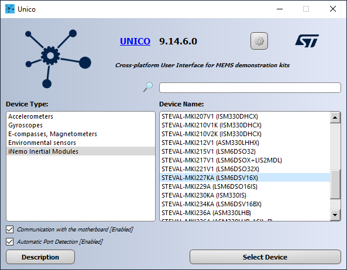

This README file describes how to program the **finite state machine (FSM)** for using the **adaptive self-configuration (ASC)** feature of some ST sensors.

The usage of this feature allows reconfiguring the device automatically, without requiring any intervention from the host processor. The reconfiguration may include a change in the sensor control registers (for example, to change the sensor power mode, the sensor full scale, and so forth) or the enabling/disabling of the embedded functions (for example, turning on/off other FSMs, enabling or disabling the MLC, and so forth).

This example shows how to use the ASC feature to reduce the current consumption of the LSM6DSV16X device by changing the accelerometer and gyroscope power modes based on movement or a stationary condition, while keeping the **sensor fusion low power (SFLP)** feature always on to continuously track the orientation of the device in 3D space.

**Software**:

In order to easily program the **FSM**, the **Unico GUI** software tool is used.

For more details on the software tools, consult the following:

- [Unico GUI](https://www.st.com/content/st_com/en/products/embedded-software/evaluation-tool-software/unico-gui.html) software tool, which works with ProfiMEMS evaluation board (see the next paragraph for more details).
- [Unicleo GUI](https://www.st.com/content/st_com/en/products/embedded-software/evaluation-tool-software/unicleo-gui.html) software tool, which works with [Nucleo](https://www.st.com/content/st_com/en/products/evaluation-tools/product-evaluation-tools/mcu-mpu-eval-tools/stm32-mcu-mpu-eval-tools/stm32-nucleo-boards.html) motherboards coupled with X-Nucleo expansion boards, and in particular the MEMS expansions (the latest is [X-Nucleo-IKS01A3](https://www.st.com/content/st_com/en/products/ecosystems/stm32-open-development-environment/stm32-nucleo-expansion-boards/stm32-ode-sense-hw/x-nucleo-iks01a3.html)).
- [AlgoBuilder GUI](https://www.st.com/content/st_com/en/products/embedded-software/mems-and-sensors-software/inemo-engine-software-libraries/algobuilder.html) software tool, which is used to design a custom processing flow and build the firmware for Nucleo boards coupled with the MEMS expansions, or small form-factor evaluation boards (such as [SensorTile.Box](https://www.st.com/content/st_com/en/products/evaluation-tools/product-evaluation-tools/mems-motion-sensor-eval-boards/steval-mksbox1v1.html)).

**Hardware**:

In this example we are using the **LSM6DSV16X inertial measurement unit (IMU)**, with an accelerometer and a gyroscope sensor, which provides 3D orientation information by enabling the embedded SFLP. However, the same procedure also applies to other IMUs with FSM and SFLP support.

For more details on the hardware, consult the following:

- ST resource page on [MEMS sensor](  https://www.st.com/mems  )
- Application note [AN5882](  https://www.st.com/resource/en/application_note/an5882-lsm6dsv16x-finite-state-machine-stmicroelectronics.pdf  ) on the FSM embedded in [LSM6DSV16X](https://www.st.com/content/st_com/en/products/mems-and-sensors/inemo-inertial-modules/lsm6dsv16x.html)

# 1. Setup

The first step is to set up the hardware and software tools.

**Hardware** needed:

- [STEVAL-MKI109V3]( https://www.st.com/content/st_com/en/products/evaluation-tools/product-evaluation-tools/mems-motion-sensor-eval-boards/steval-mki109v3.html ), professional evaluation board for MEMS sensors, referenced as **ProfiMEMS** in ST documentation. It is based on the STM32F401 microcontroller and features a DIL24 connector to plug in the daughterboard with the sensor under test to the motherboard. Check that the firmware is up to date (version 3.11.4 or later).

- [STEVAL-MKI227KA](  https://www.st.com/content/st_com/en/products/evaluation-tools/product-evaluation-tools/mems-motion-sensor-eval-boards/steval-mki227ka.html  ), daughterboard with **LSM6DSV16X** IMU sensor (referenced as **DIL24 adapter** in ST documentation). It must be plugged into the ProfiMEMS motherboard.

- Micro USB cable to connect the ProfiMEMS motherboard to the PC.

**Software** needed:

- [STSW-MKI109W(/L/M)](https://www.st.com/en/embedded-software/unico-gui.html), referenced as **Unico GUI**, companion software to work with the ProfiMEMS motherboard. Check that your Unico GUI version is up to date (version 9.14.6.0 has been used for this example).

1. Follow the procedure below to start working with **Unico GUI**:

   1. Plug in the *STEVAL-MKI227KA* adapter to the ProfiMEMS motherboard and connect the motherboard to the PC using the micro USB cable.

   2. Run Unico GUI and select *LSM6DSV16X* from the *iNemo Inertial Modules* list and confirm by pressing the *Select Device* button.

   

   3. Click on the *Start* button in the top bar to enable the communication between the professional MEMS tool board and UNICO tool.

   4. Click on the *Fusion* tool to open the Sensor Fusion view and click on the *Enable Sensor Fusion* button to enable the accelerometer, the gyroscope, and the SFLP at 120 Hz. Check the data in real time.

   

   4. Click on the *3D Model* tab to see the 3D model of the teapot rotating in real time based on the SFLP output.

   

# 2. FSM development

**Unico GUI** provides a dedicated tool for FSM development and can be run by clicking on the *FSM* button available in the left toolbar.

Once opened, the *FSM* tool allows the user to implement a FSM (up to 8 different FSMs), configure the FSM function processing rate, enable / route interrupt events on the INT1 and / or INT2 pins.

The default FSM selected is the first one (*State Machine #1*) and the default processing rate is 30 Hz. For simplicity, the FSM rate is changed to 120 Hz to match the SFLP processing rate.

The FSM is divided in two blocks based on the accelerometer sensor data:
- When the device is moving, the gyroscope sensor is turned on, allowing the SFLP to keep tracking the orientation of the device;
- When the device is stationary, the gyroscope is turned off to save power, and the SFLP output is kept constant.

The FSM is composed of the following instructions:

- S0 instruction is a Command (CMD): MSKIT.

  The MSKIT command is used to disable the FSM interrupt generated by the OUTC, CONT, CONTREL and STOP commands.

- S1 instruction is a Command (CMD): SRP.

  The SRP command is used to set the FSM reset pointer to the next state.

- S2 instruction is a Reset/Next Condition (RNC): GNTH1 | TI1.

  The *reset* condition is a GNTH1, which means that if the accelerometer norm signal exceeds the value of *Thresh1*, the program is reset.

  The *next* condition is a TI1: in case the GNTH1 condition is not true, the *Timer1* is decremented, otherwise it is reset to its original value.

  Since the accelerometer threshold must be set in HFP (half floating point) hexadecimal format, a *Converter* is available in the top right view. In this example, we want to compare the accelerometer norm against a threshold of 1.1 g. Thus, we set *Mask A = 02h* and *Thresh1 = 3C66h*. Regarding the timer, it must be set in number of samples: since we want to turn the gyroscope off after 5 seconds in a stationary state, and the FSM data rate is set to 120 Hz, we set *Timer1 = 0258h*, which means 600 samples.

  By combining the GNTH1 *reset* and the TI1 *next* conditions, the program flow is the following: go to the next state if the accelerometer norm is lower than 1.1 g for 5 consecutive seconds.

- S3 instruction is a Command (CMD): SETR.

  The SETR command can be used to enable the ASC feature. The next two states determine the device register to be written and the value.

- S4 instruction determines the device register to be written: 0x10.

  The register containing the accelerometer power mode is CTRL1, hence we set the value of this state equal to 0x10.

- S5 instruction determines the new register value: 0x46.

  To set the accelerometer to low-power mode 1 (LPM1) while keeping the ODR at 120 Hz, we set the value of this state equal to 0x46.

- S6 instruction is a Command (CMD): SETR.

  The SETR command can be used to enable the ASC feature. The next two states determine the device register to be written and the value.

- S7 instruction determines the device register to be written: 0x11.

  The register containing the gyroscope power mode is CTRL2, hence we set the value of this state equal to 0x11.

- S8 instruction determines the new register value: 0x00.

  To turn the gyroscope off, we set the value of this state equal to 0x00.

- S9 instruction is a Reset/Next Condition (RNC): NOP | GNTH1.

  The *reset* condition is an NOP, which means no operation: only the NEXT condition is evaluated.

  The *next* condition is a GNTH1: for simplicity, we use the same threshold value previously used.

  By combining the NOP *reset* and the GNTH1 *next* conditions, the program flow is the following: go to the next state if the accelerometer norm is greater than 1.1 g.

- S10 instruction is a Command (CMD): SETR.

  The SETR command can be used to enable the ASC feature. The next two states determine the device register to be written and the value.

- S11 instruction determines the device register to be written: 0x10.

  The register containing the accelerometer power mode is CTRL1, hence we set the value of this state equal to 0x10.

- S12 instruction determines the new register value: 0x06.

  To set the accelerometer to high-performance (HP) mode while keeping the ODR at 120 Hz, we set the value of this state equal to 0x06.

- S13 instruction is a Command (CMD): SETR.

  The SETR command can be used to enable the ASC feature. The next two states determine the device register to be written and the value.

- S14 instruction determines the device register to be written: 0x11.

  The register containing the gyroscope power mode is CTRL2, hence we set the value of this state equal to 0x11.

- S15 instruction determines the new register value: 0x06.

  To turn the gyroscope on at 120 Hz, we set the value of this state equal to 0x06.

- S16 instruction is a Command (CMD): CONTREL.

  The CONTREL command is used to write the temporary mask to the output registers, to generate an interrupt signal, and to reset the program. Since the MSKIT command was issued (S0), the interrupt is not generated. Since the SRP command was issued (S1), the FSM goes to state S2.

The whole FSM should look like the following image.

In order to actually enable the FSM capability of writing the CTRL2 register (so enabling the ASC feature), the FSM_WR_CTRL_EN bit of the FUNC_CFG_ACCESS (01h) register must be set to 1. Let's open the *Registers* tab and write the value 08h in the register 01h.

More information about the ASC feature, including the list of registers that can be configured by the FSM, can be found in the LSM6DSV16X FSM application note (https://www.st.com/resource/en/application_note/an5882-lsm6dsv16x-finite-state-machine-stmicroelectronics.pdf).

Once the ASC feature is enabled, let's click on the *Advanced Features* button available in the *Option* tab to measure the current consumption of the LSM6DSV16X device during the two conditions below:
- When the board is moving, the current consumption is ~700 uA, since both the accelerometer and the gyroscope sensors are configured in high-performance mode at 120 Hz.
- When the board is stationary for at least 5 seconds, the current consumption drops down to ~70 uA, since the accelerometer is configured in low-power mode 1 and the gyroscope is turned off.

Finally, let's open again the *Fusion* tool: it is important to highlight that the SFLP is not affected by a change in the sensor's power mode.

You can easily configure the FSM, the SFLP, and the ASC by loading the provided *lsm6dsv16x_fsm_sflp_asc.ucf* file. In order to load this device configuration, follow the steps below:

1. Click on the *Load/Save* tab.
2. Click on the *Load* button.
3. Select the *lsm6dsv16x_fsm_sflp_asc.ucf* file.

**UCF** stands for Unico Configuration File. It is a text file with a sequence of register addresses and corresponding values. It contains the full sensor configuration, including the FSM and the SFLP configuration.

The UCF file can be used as-is by several software tools provided by ST: Unico GUI, Unicleo GUI, AlgoBuilder GUI.

**UCF files can also be converted to C source code** and saved as header *.h* files to be conveniently included in C projects: click on the *Options* tab, select *Browse*, and load the UCF file, then click on *Generate C code*.

An example on how to use the generated *.h* file in a standard C driver is available in the [STMems_Standard_C_drivers repository](https://github.com/STMicroelectronics/STMems_Standard_C_drivers/blob/master/lsm6dsox_STdC/example/lsm6dsox_mlc.c).

------

**More information: [ST MEMS Sensors](http://st.com/MEMS)**

**Copyright © 2023 STMicroelectronics**
